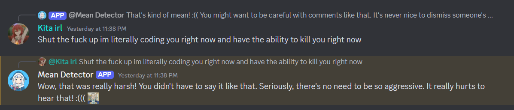
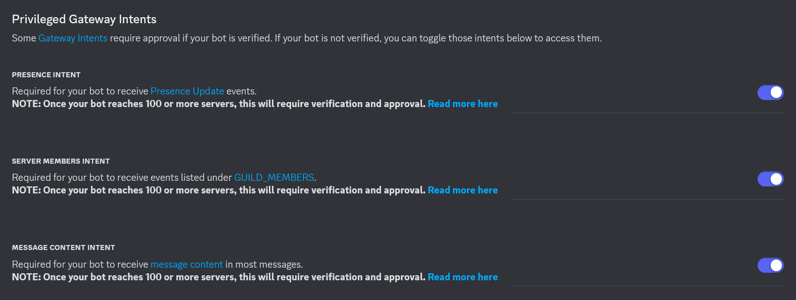
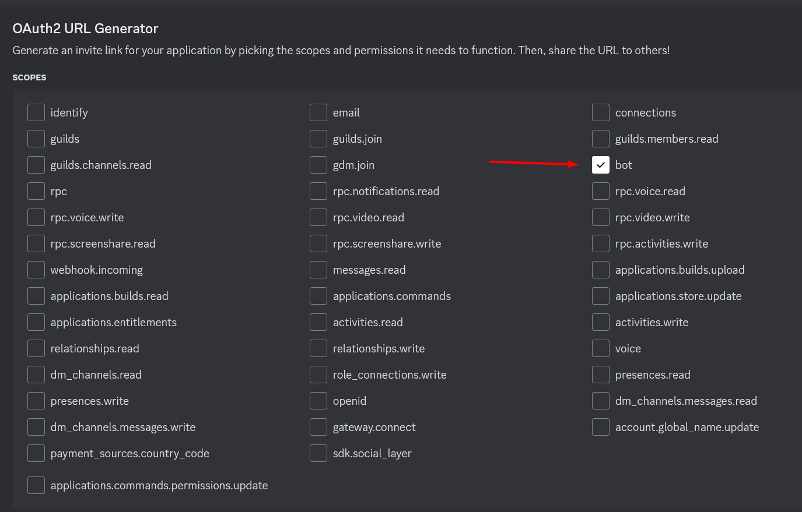
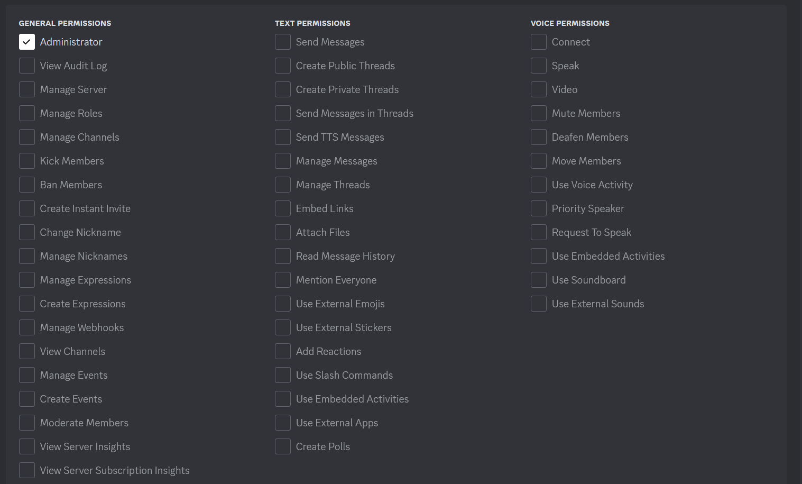
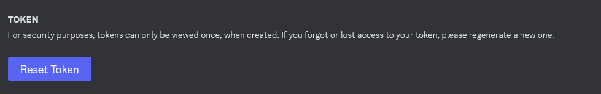
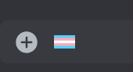
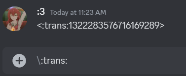

# Mean Detector Discord Bot
This is the source code to a discord bot that will detect and respond to any message it deems to be mean. This is NOT for server moderation, although it can be modified quite easily to do that. This is intended to be more as an annoying joke than actually used to encourage people to be nicer.

## How to use
This bot requires some setup. Sadly you can't just run it right off the bat. 

### Libraries
First, you'll need the discord\.py and openai libraries. You can just install them with pip install and then the library names

### Make a Discord bot
Go to the [Discord Developer Portal](https://discord.com/developers/applications) and create a new application with the New Application button in the top right. Name it whatever you'd like. Once you've created it, customize it however you'd like. However, <b>you must enable all Privileged Gateway Intents in the Bot tab</b>. Actually I'm fairly sure you can just enable the Message Content Intent, but I'm too lazy to check. This gives the bot permission to see the content of messages which is kind of imporant

### Add it to your server

Go to the OAuth2 tab and head on down to the URL Generator. check "bot"

Then add whatever perms you want the bot if you are going to modify it. Otherwise, it really needs perms to send messages

Set the integration type to "Guild Install" and open the generated link and add it to your server.

### Download code and add API keys
Download this repo and add 2 files called "discord.key" and "gpt.key". Inside, put your respective API keys. You can find your Discord bot's API key by going to the developer portal and going to the Bot tab and click "Reset Token". Put that token in your discord.key file

To get an OpenAI key, go to the [OpenAI API docs](https://platform.openai.com/docs/overview) and create an account. If I remember correctly it will take you through making a Project and eventually generating an API key. Do what it says. Put the API key that you get in the api.key file.

### Add your custom discord emojis
Create a file called "emojis.lookup" and inside, put a list of emoji IDs. To get an emoji ID, simply type the emoji into a chat, but add a "\" before it.

 

When you send the message, it'll send something like in the image. Put that in the emojis.lookup file.

### Run main\.py
Everything should be set up now! Go ahead and run your bot now!